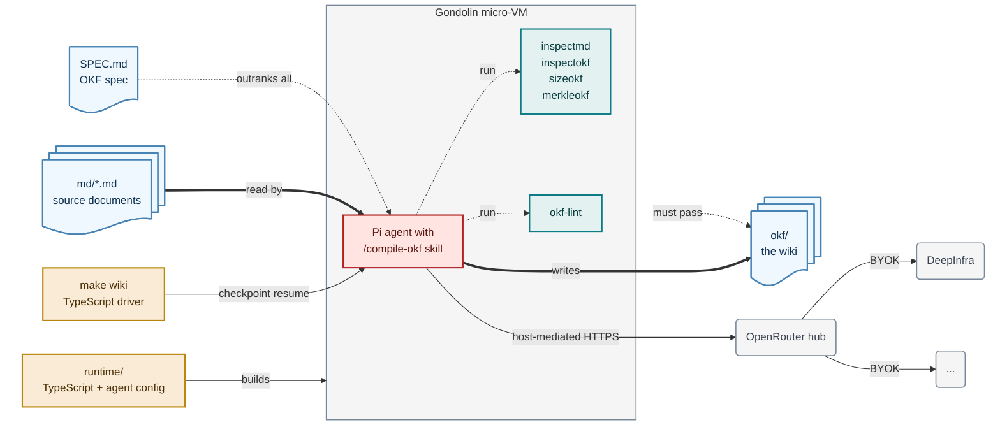

# md2okf-gondolin

[](https://github.com/lars20070/md2okf-gondolin/actions/workflows/ci.yml)
[](https://deepwiki.com/lars20070/md2okf-gondolin)
[](LICENSE)

Compile Markdown documents into an OKF knowledge base with a coding agent.

Drop Markdown files into `md/`, run `make wiki`, and the [Pi coding
agent](https://pi.dev) writes a wiki into `okf/`: a page per topic, an index in
every directory, links between them, and a log of what each run changed. OKF,
the [Open Knowledge
Format](https://github.com/GoogleCloudPlatform/knowledge-catalog/tree/main/okf),
is a tree of Markdown files with YAML frontmatter and nothing else — no schema
registry, no server, nothing to install. The agent takes one source document per
run and folds it into the wiki already on disk, so documents accumulate rather
than overwrite. [SPEC.md](SPEC.md) is the OKF specification the wiki is built
against; the agent reads it at the start of every run, and it outranks any
other instructions.

<!-- cspell:disable -->



<!-- cspell:enable -->

## Contents

- [Requirements](#requirements)
- [Quickstart](#quickstart)
- [How it works](#how-it-works)
- [What lands in okf/](#what-lands-in-okf)
- [Getting Markdown in](#getting-markdown-in)
- [Set the OpenRouter key](#set-the-openrouter-key)
- [Troubleshooting](#troubleshooting)
- [Development](#development)
- [Getting help](#getting-help)
- [License](#license)

## Requirements

- macOS with [Homebrew](https://brew.sh). VM commands currently require
  Apple's Hypervisor Framework (HVF); Linux is not supported by the task
  runner.
- Node.js 23.6 or newer and QEMU. Docker Desktop is not required.
- An [OpenRouter](https://openrouter.ai) API key, which pays for the model the
  agent runs on.
- `make`, `git`, and `uv`.

## Quickstart

```bash
brew install node qemu uv
make install-runtime install-clis
make runtime-image
export OPENROUTER_API_KEY=sk-or-...
cp my-document.md md/
make wiki
```

Each document gets its own agent run, and each run reports the wiki's root hash
before and after (tool calls and agent prose stream in between):

```text
Compiling document md/my-document.md (iteration 1)
7f3c1a9d4e02 -> b481d05c6a17
Compiling document md/my-document.md (iteration 2)
b481d05c6a17 -> b481d05c6a17
```

The wiki lands in `okf/`, which is gitignored apart from `okf/.okflintrc.json`,
so the generated pages stay out of the repo. `md/` is tracked and ships with
sample documents, so `make wiki` has something to compile straight away.

## How it works

A TypeScript driver on the host resumes a provisioned Gondolin checkpoint and
runs the agent inside a fresh micro-VM, repeatedly, until a hash of the output
stops moving. The host drives; everything else happens inside the sandbox.

`make wiki` starts one VM per `md/*.md` file and mounts a deliberately sparse
workspace: `SPEC.md` plus read-only `md/`, writable `okf/`, the read-only Pi
config, and session storage. It re-runs the same document (a *Ralph loop*) until
`merkleokf --nolog -L 0` reports an unchanged wiki root hash. `merkleokf` prints
a Merkle hash tree, one hash per file and per directory, so a change to any page
moves the root hash and an unchanged root means the run added nothing. The loop
is capped by `RALPH_MAX` (default 10). The agent's only writable output is
`okf/`, [okf-lint](https://github.com/thisismydesign/okf-lint) must pass before
it finishes, and `SPEC.md` outranks every instruction file. Each run streams
tool names and assistant text as it goes, and writes a session transcript under
`logs/sessions/`. Gondolin mediates filesystem and HTTP access on the host:
writes to the tracked `okf/.okflintrc.json` are denied, runtime egress is
allowlisted, and the API key is substituted only into OpenRouter requests.

### Repository layout

| Path | Description |
| --- | --- |
| `md/` | source documents, one agent run each |
| `okf/` | the generated wiki |
| `Makefile` | every task worth running; `make wiki` compiles |
| `scripts/` | shell entry points and the four helper CLIs (`inspectmd`, `inspectokf`, `sizeokf`, `merkleokf`) |
| `runtime/` | Gondolin drivers, checkpoint provisioner, Pi config, and tests |
| `SPEC.md` | the [OKF specification](https://github.com/GoogleCloudPlatform/knowledge-catalog/blob/main/okf/SPEC.md) the wiki is built against |
| `AGENTS.md` | instructions for coding agents working *on this repo*, not for Pi |
| `pdf2md/` | optional: converts a PDF into `md` |
| `web2md/` | optional: scrapes a documentation site into `md` |

## What lands in okf/

```text
okf/
├── index.md          # root index, the only one carrying frontmatter
├── log.md            # what each run changed, newest first
├── <page>.md         # a content page at the wiki root
└── <topic>/          # one directory per topic, nested as deep as it needs
    ├── index.md      # a plain link list for this directory
    └── <page>.md     # a content page within the topic
```

Content pages carry `type`, `title`, `description` and `tags` in their
frontmatter. Slugs are kebab-case. Links are bundle-absolute, so
`/glossary/verb.md` rather than `glossary/verb.md`. The root `index.md` names
the spec version the agent reads. Pages are updated in place, not duplicated, so
compiling the same document twice is safe.

## Getting Markdown in

`md/` wants clean, structured Markdown, and a source document is rarely that.
Two helpers produce it. Both are optional, and neither is part of `make wiki`.

**From a PDF.** `marker` converts one with the help of a language model, either
a local Ollama model or a cloud model through OpenRouter. Expect to check the
output, and run the step by hand — see
[the pdf2md guide](pdf2md/README.md).

**From a website.** `make scrape` walks a documentation site and writes one
Markdown document into `md/`. No model is involved, so the result is
deterministic, and the fetched HTML is cached — see
[the web2md guide](web2md/README.md).

## Set the OpenRouter key

Export the key in the host shell that runs `make wiki` or `make agent`:

```bash
export OPENROUTER_API_KEY=sk-or-...
```

Guest code sees only a generated placeholder. Gondolin's host-side HTTP hook
replaces that placeholder with the real key for `openrouter.ai` and nowhere
else. The runtime does not write the key to the checkpoint or guest filesystem.

## Troubleshooting

**`qemu-img` is missing.** Install QEMU with `brew install qemu`.

**The checkpoint is missing.** Run `make runtime-image` on the Mac.

**The OpenRouter key is missing.** Export `OPENROUTER_API_KEY` in the current
shell before `make wiki` or `make agent`.

**`Error: Ralph loop hit 10 iterations`.** The wiki root hash kept changing.
Raise the cap for one run with `RALPH_MAX=20 make wiki`, or read
`logs/sessions/` to see what the agent was doing.

## Development

Lint, tests, the sandbox checks, the helper CLIs and the per-subproject layout
are covered in [the contributing guide](CONTRIBUTING.md). The short version:
`make lint` checks the source tree, `make validate` checks the TypeScript
runtime and its pure unit tests, and CI runs both on every pull request.
`make install-runtime` installs the pinned host dependencies, and
`make install-clis` puts the helper CLIs on your PATH.

## Getting help

Questions, bugs and feature requests belong in [the issue
tracker](https://github.com/lars20070/md2okf-gondolin/issues).

## License

Released under the [MIT License](LICENSE).
